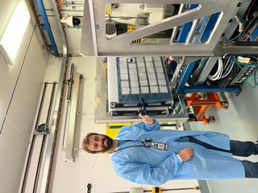

# Plant AWG Action Plan

<figure><figcaption>
Borja the excited astrobotany researcher prepairs to iradiate his plants at Brookhaven National Laboratory. 
</figcaption></figure>

Link to Plant AWG Community Diary [Click here!](https://docs.google.com/document/d/1yXqnamKvrzBq-P0H-DuCmU\_BjZ6ZOCg9xqzlVXfQblM/edit?usp=sharing)



[Link to membership review documentation](https://docs.google.com/spreadsheets/d/17Fw1ZKrqDEYeUoYxkhUTTk-r7Glz1fmAloXpz7Ro0bs/edit?usp=sharing)



<figure><figcaption>
Welcome aboard, we look forward to collaborating with you. 
</figcaption></figure>

