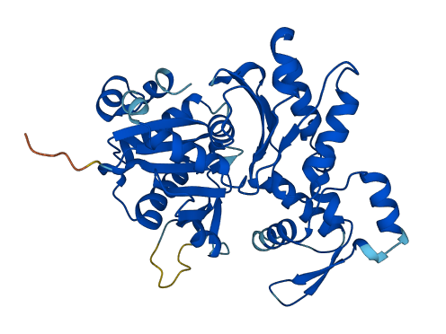

# Plants AWG Overview

[](https://private-user-images.githubusercontent.com/158081608/300640364-81bed992-edfc-4df8-9917-9fb09265359d.png?jwt=eyJhbGciOiJIUzI1NiIsInR5cCI6IkpXVCJ9.eyJpc3MiOiJnaXRodWIuY29tIiwiYXVkIjoicmF3LmdpdGh1YnVzZXJjb250ZW50LmNvbSIsImtleSI6ImtleTUiLCJleHAiOjE3MTM5NzkzMzgsIm5iZiI6MTcxMzk3OTAzOCwicGF0aCI6Ii8xNTgwODE2MDgvMzAwNjQwMzY0LTgxYmVkOTkyLWVkZmMtNGRmOC05OTE3LTlmYjA5MjY1MzU5ZC5wbmc\_WC1BbXotQWxnb3JpdGhtPUFXUzQtSE1BQy1TSEEyNTYmWC1BbXotQ3JlZGVudGlhbD1BS0lBVkNPRFlMU0E1M1BRSzRaQSUyRjIwMjQwNDI0JTJGdXMtZWFzdC0xJTJGczMlMkZhd3M0X3JlcXVlc3QmWC1BbXotRGF0ZT0yMDI0MDQyNFQxNzE3MThaJlgtQW16LUV4cGlyZXM9MzAwJlgtQW16LVNpZ25hdHVyZT05OWVjZjhlOWYwOTdlNGQyNWUyYjU5YzRjN2ZkMDhiNDRkYTUxYzQ3Mzk0YWIzM2IzZWY0YzRmNDE4MzE0MDIxJlgtQW16LVNpZ25lZEhlYWRlcnM9aG9zdCZhY3Rvcl9pZD0wJmtleV9pZD0wJnJlcG9faWQ9MCJ9.6FEYDD4R6hP9H0CjhbihrOhT0MOkzxMPAFFowcs\_gsY)

## Plants Analysis Working Group (AWG)

The Plants Analysis Working Group is comprised of international research scientists and professors working together with a shared goal of developing a central document exploring the metadata and scientific findings from spaceflight and ground-based experiments. The group's meta-analysis research focused on the transcriptional response of Arabidopsis to spaceflight and the integration of epigenetics, proteomics, and glycomic datasets to make predictions and guide future research into the metabolic response of crops in orbit. Additionally, the group has contributed to building new analysis pipelines, providing input on standardizing plant metadata terms, and publishing collaborative manuscripts utilizing GeneLab omics data. This working group is striving to enhance the visibility and utility of GeneLab and spur new collaborations to develop the fundamental and applied knowledge to enable long-term spaceflight and ground-based advances to agriculture. Plants AWG members meet regularly to share and discuss the latest developments in AstroBotany – the discipline of botany concerned with interactions between plant biology and the space environment.

**Actin**

<figure><figcaption>
Actin
</figcaption></figure>

<figure><figcaption>
Zoomed into see actin hydrogen bonding up close.
</figcaption></figure>
